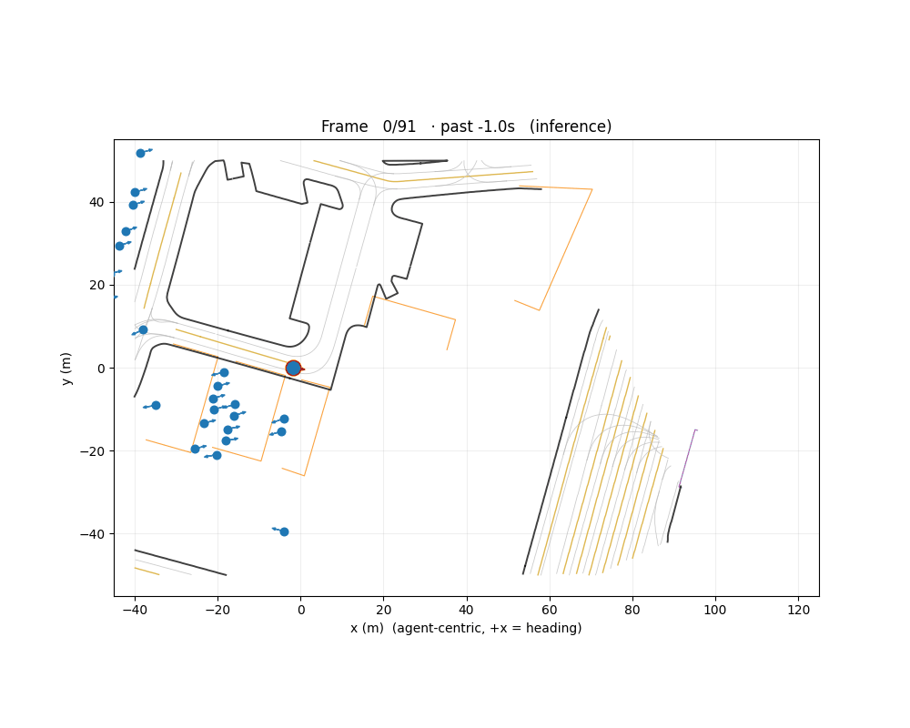
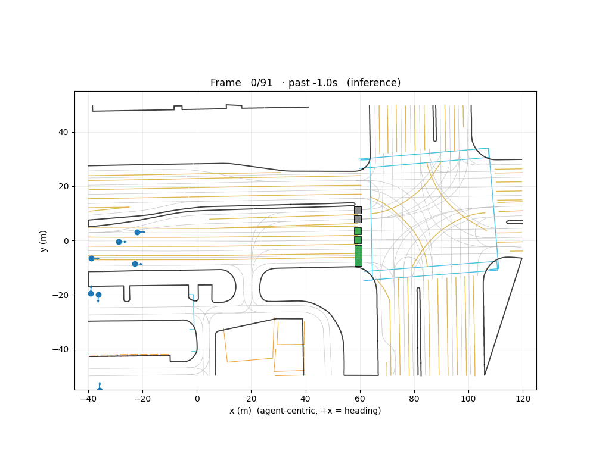
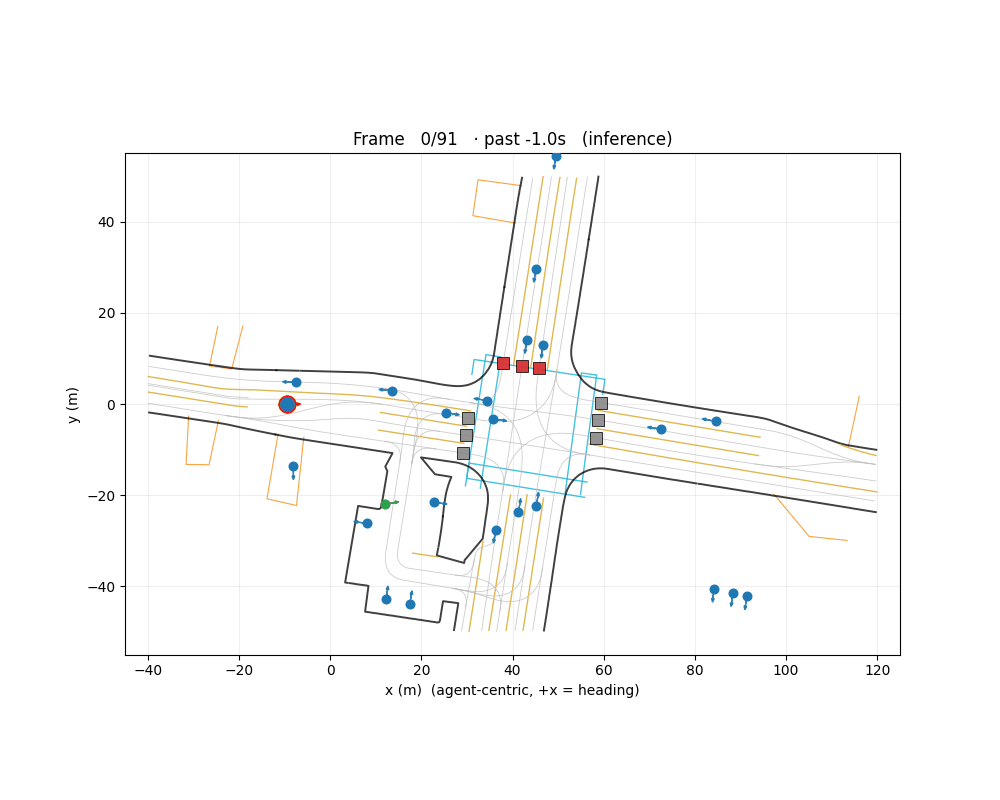
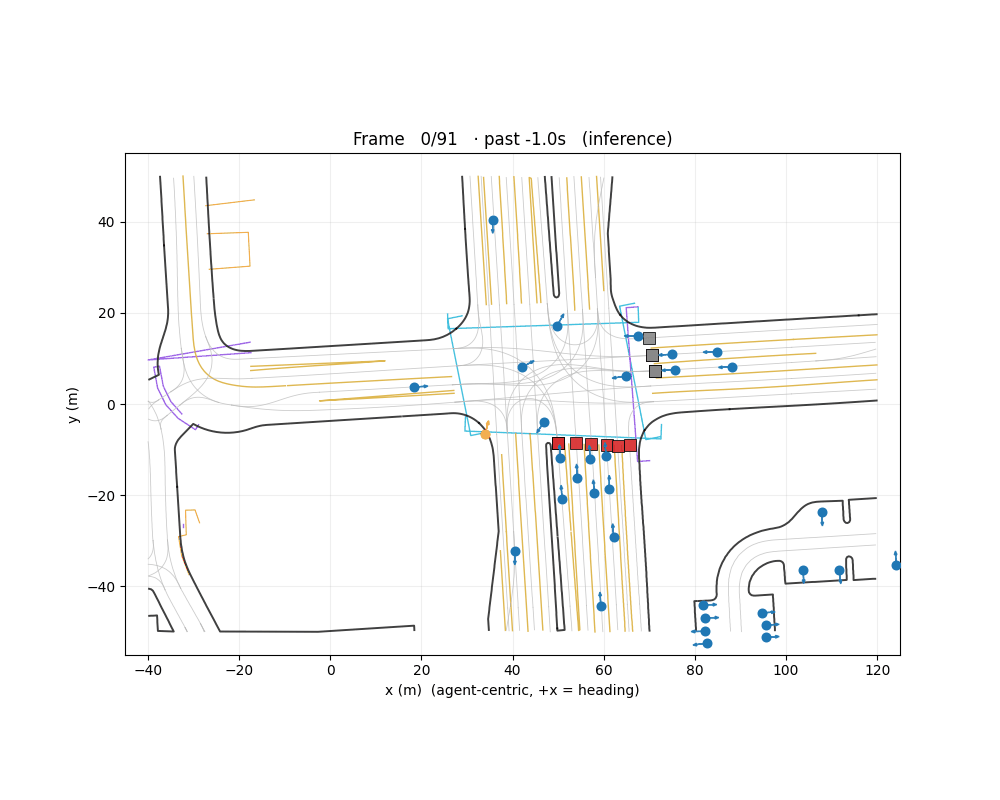
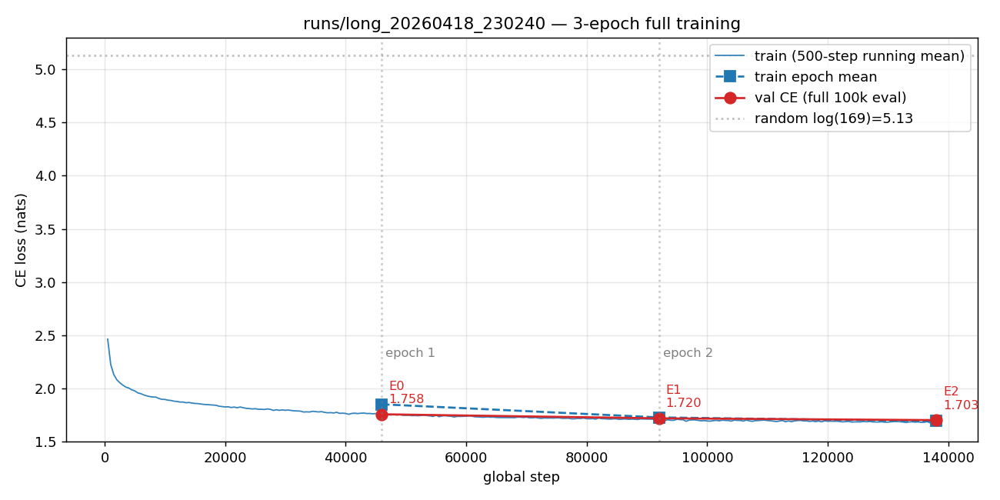
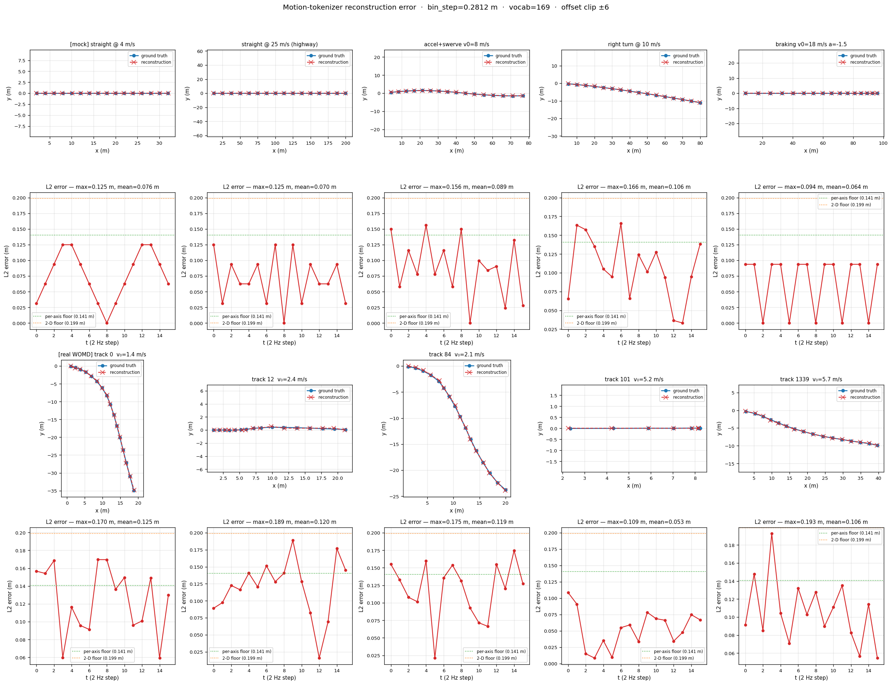

# MotionLM: Multi-Agent Motion Forecasting as Language Modeling

MotionLM represents continuous trajectories as sequences of discrete motion tokens and casts multi-agent motion prediction as a language modeling task. 
This repository contains a reproduction of the MotionLM model from the paper:

**"MotionLM: Multi-Agent Motion Forecasting as Language Modeling"**  
*Ari Seff, Brian Cera, Dian Chen, Mason Ng, Aurick Zhou, Nigamaa Nayakanti, Khaled S. Refaat, Rami Al-Rfou, Benjamin Sapp*  
International Conference on Computer Vision (ICCV) 2023  
[Paper Link](https://arxiv.org/abs/2309.16534)

## Demo

A 10.8M-parameter MotionLM trained for 3 full epochs (≈138k steps, batch=48) on the WOMD `VEHICLE` marginal split. End-of-epoch eval on 100k val samples at K=64 gave:
**val CE=1.70 · minADE@8s=1.96 m · minFDE@8s=4.39 m · MR@8s=0.39**.

All animations below show 11 past + 80 future frames @ 10 Hz in agent frame (modeled agent at origin, +x = heading). The 6 predicted modes are color-coded by confidence; the dashed black line is the ground-truth future.

### Working predictions

Lowest-FDE samples from a 225-sample scan — the model tightly tracks GT across the 8 s horizon.

| val.100 / sample 9 — highway, ~15 m/s, minFDE@8s ≈ 0.3 m | val.20 / sample 7 — urban, ~5 m/s, minFDE@8s ≈ 0.3 m |
|:--:|:--:|
|  |  |

### Failure cases

Representative high-error samples. These are what drives the aggregate MR@8s = 0.39 — fast agents, wrong lane/direction commitment, or early token errors that compound over 8 s.

| val.0 / sample 2 — minFDE@8s ≈ 41 m | val.100 / sample 0 — mode cloud drifts off GT |
|:--:|:--:|
|  |  |

### Training and tokenizer diagnostics

**Training loss** (3-epoch, 138k steps, constant LR 2e-4). The plateau at ~1.69 was the primary signal to add warmup + cosine decay (see Roadmap):



**Verlet tokenizer reconstruction** — the quantization floor for a 13×13 bin grid. Finer grids (17×17) could meaningfully lower the minADE floor:



## Reproduced Components

This reproduction implements the core components of MotionLM:

### 🎯 Motion Tokenizer (`model/motion_tokenizer.py`)
- Verlet-wrapped motion tokenizer that encodes trajectory corrections as discrete tokens
- Uses a BxB grid to quantize small corrections (dx_corr, dy_corr)
- Implements Verlet integration: Δ_t = Δ_{t-1} + δ_t

### 🏛️ Scene Encoder (`model/scene_encoder.py`)
- Processes multi-modal scene context including:
  - Agent historical trajectories
  - Lane information 
  - Traffic light states
- Outputs scene memory tokens for conditioning the decoder

### 🔮 Motion Decoder (`model/motion_decoder.py`)
- Transformer-based autoregressive decoder
- Generates motion tokens conditioned on scene memory
- Supports both training (teacher forcing) and inference modes

### 🧠 MotionLM Model (`model/motionlm.py`)
- Complete end-to-end model combining scene encoder and motion decoder
- Implements training and inference workflows
- Supports multi-agent joint prediction

## Quick Start

### Requirements
- Python 3.7+
- PyTorch
- Tensorflow

### Run the tests

```bash
uv run pytest tests/
```

Covers tokenizer round-trip, sparse/dense shard schema, scene encoder, decoder,
and full end-to-end forward + inference.

### Train a model

For a quick sanity run (one shard each side, ~3 min on an RTX 5080):

```bash
uv run python -m training.train_multi_epoch \
    --train-shards /path/to/shards/training/train.0of1000.pt.zst \
    --val-shards   /path/to/shards/validation/val.0of150.pt.zst \
    --out-dir runs/smoke --epochs 2 --steps-per-epoch 500 \
    --batch-size 48 --eval-samples 64 --K 32 --amp
```

For an unattended full run (1 epoch ≈ 2.21M samples ≈ 82 min at batch=48, plus
end-of-epoch eval):

```bash
uv run python -m training.train_multi_epoch \
    --train-shards /path/to/shards/training/train.*.pt.zst \
    --val-shards   /path/to/shards/validation/val.*.pt.zst \
    --out-dir runs/run_$(date +%Y%m%d_%H%M%S) \
    --epochs 6 --steps-per-epoch 46000 \
    --batch-size 48 --eval-samples 10000 --K 64 --amp
```

Output layout: `<out_dir>/checkpoints/epoch_NN.pt` + `<out_dir>/log.jsonl`
(one `run_meta` line + one `epoch` line per epoch, carrying train/val losses
and minADE/minFDE/MR at 3/5/8 s). Per-epoch checkpoints mean a crash costs at
most one epoch. For single-epoch runs with finer-grained checkpointing, use
`training.train` directly (see below).

## Model Architecture

```
Input Scene Data → Scene Encoder → Scene Memory
                                        ↓
                   Motion Tokens → Motion Decoder → Next Token Logits
```

### Key Features:
- **Discrete Motion Tokens**: Continuous trajectories tokenized using Verlet integration
- **Multi-Modal Scene Context**: Joint encoding of agents, lanes, and traffic signals
- **Autoregressive Generation**: Sequential token prediction for future trajectories
- **Multi-Agent Modeling**: Joint prediction of interacting agent futures

## Configuration

Model hyperparameters can be adjusted in `model/config.py`:

- `d_model`: Token embedding dimension (default: 256)
- `vocab_size`: Motion token vocabulary size (default: 169)
- `bins_per_coord`: Discretization bins per coordinate (default: 13)
- `max_corr`: Maximum correction magnitude (default: 1.5)

## Training performance knobs

`training/train.py` exposes four flags that trade compute, memory, and
numerical robustness. Measured on an RTX 5080 at batch=16, 10.81M params:

| Flag | What it does | Effect |
|---|---|---|
| `--amp` | **bf16 autocast** (not fp16). No `GradScaler` needed — bf16's fp32-matching exponent range means CE loss can't overflow. | ~10% step-time cut vs fp32; same speed as fp16 with cleaner code. |
| *(built-in)* | **SDPA everywhere.** Decoder SA/CA *and* encoder Perceiver CA + 6 self-attn layers all use `MultiheadSDPA` (`model/attention.py`), which calls `F.scaled_dot_product_attention`. FlashAttention fires on all mask-free attentions (decoder CA, encoder Perceiver CA, encoder self-attn); decoder SA falls back to memory-efficient attention because the block-staircase mask isn't pure causal. | +17% samples/s at batch=32 vs `nn.MultiheadAttention`. |
| `--compile` | Wraps the model with `torch.compile`. One-off ~60 s warmup. | Break-even on this 11M-param model. Kept as a flag for when the model grows. |
| `--grad-ckpt` | Recomputes activations during backward — on all 3 encoder embedders, the Perceiver CA, each encoder self-attn block, and each decoder block (`torch.utils.checkpoint`, `use_reentrant=False`). Toggled via `MotionLMConfig.grad_checkpoint`. | Frees the 4 GB roadgraph-MLP hidden activation (B·R·P·d_ff at B=64 ≈ 4.3 GB). Pays ~30% extra compute per block. On 16 GB GPU, **batch=48 fits without ckpt and is faster than batch=64 with ckpt** — the flag is only useful if you need batch≥64 for gradient-noise reasons. |

Measured on one RTX 5080 (16 GB), shard `train.576of1000.pt.zst`, bf16 + SDPA:

| batch | ckpt? | step (ms) | samples/s | peak GPU | notes |
|---|---|---|---|---|---|
| 16 | no | 42.8 | 373 | 4.0 GB | default — plenty of headroom |
| 32 | no | 73.7 | 434 | 7.8 GB | |
| **48** | **no** | **105.9** | **453** | **11.5 GB** | **best on 16 GB** |
| 64 | yes + `PYTORCH_CUDA_ALLOC_CONF=expandable_segments:True` | 177.1 | 361 | 15.3 GB | compute-saturated; ckpt overhead > batch gain |

Per-step breakdown at batch=16 (bf16 + SDPA):
data 0.1 ms · h2d 1.4 ms · **fwd 12.1 ms (28%) · bwd 26.9 ms (63%)** · opt 2.2 ms.

**Epoch time** (dataset ≈ 2.24M examples = 1000 shards × ~2,239 examples):
- batch=48 @ 453 samples/s → **≈ 82 min/epoch**
- batch=16 @ 373 samples/s → ~100 min/epoch
- (original fp16+MHA baseline @ 338 samples/s → ~110 min/epoch)

**Bottleneck**: still the backward pass (~60% of step time), now spread evenly across the encoder (Perceiver CA + 6 self-attn) and decoder (4 blocks). Data loader never blocks the GPU (0.1 ms wait). Peak-memory hotspot is the per-point roadgraph MLP hidden (`B·R·P·d_ff`), not attention.

Example commands:

```bash
# default fast config — bf16 + SDPA on
uv run python -m training.train --shards <shard> --steps 2000 --batch-size 16 --amp

# best throughput on 16 GB GPU
uv run python -m training.train --shards <shard> --batch-size 48 --amp

# need batch ≥ 64 (gradient noise / LR schedule): grad-ckpt + expandable segments
PYTORCH_CUDA_ALLOC_CONF=expandable_segments:True \
  uv run python -m training.train --shards <shard> --batch-size 64 --amp --grad-ckpt

# torch.compile — currently neutral at 11M params; enable when the model grows
uv run python -m training.train --shards <shard> --amp --compile
```

## Evaluation

`training/evaluate.py` loads a checkpoint, streams a validation split, and
reports validation CE loss + WOMD interaction-prediction metrics (marginal).

### Quick check (≈ 20 s on RTX 5080)

A few hundred samples at `K=64` is enough to sanity-check that loss is
decreasing on held-out data during a training run:

```bash
uv run python -m training.evaluate \
    --checkpoint checkpoints/motionlm_sdpa_100.pt \
    --shards /home/wentao/shards/validation/val.0of150.pt.zst \
            /home/wentao/shards/validation/val.1of150.pt.zst \
            /home/wentao/shards/validation/val.2of150.pt.zst \
    --max-samples 512 --batch-size 8 --num-workers 2 --K 64
```

### Full validation (∼ 4 h at K=64, all 150 shards)

For a proper number, pass every val shard and remove the cap:

```bash
uv run python -m training.evaluate \
    --checkpoint checkpoints/my_model.pt \
    --shards /home/wentao/shards/validation/val.*.pt.zst \
    --max-samples 1000000 --batch-size 8 --num-workers 4 --K 64
```

Throughput on RTX 5080 is ~25 samples/s at K=64 and ~6 samples/s at K=512
(Stage-4 AR cost scales linearly with K). Use `--K 64` for dev-loop sanity
and `--K 512` only when you're reproducing paper numbers.

### CLI flags

| Flag | Default | Meaning |
|---|---|---|
| `--checkpoint PATH` | required | Produced by `training.train --save-path …`. Must match the current model architecture (old pre-SDPA checkpoints won't load). |
| `--shards PATH ...` | required | One or more val shards. Accepts glob expansion. |
| `--max-samples N` | 1000 | Stop after N samples (trims the final batch exactly). |
| `--batch-size N` | 4 | Eval batch — raise to 8 or 16 for more throughput. |
| `--num-workers N` | 2 | Dataloader workers. |
| `--K N` | 64 | Stage-4 rollout count. Paper uses 512. |
| `--M-modes N` | 6 | Modes kept after NMS aggregation (WOMD requires 6). |
| `--tau F` | 1.0 | Sampling temperature. |
| `--top-k N` | None | Optional nucleus-like truncation. |

### What's reported

| Metric | Source |
|---|---|
| **Val CE loss + perplexity** | Teacher-forced, same objective as training. |
| **Token top-1 accuracy** | Teacher-forced argmax over 169-token vocab. |
| **minADE @ 3 / 5 / 8 s** | Min over 6 modes of mean L2 over the horizon. |
| **minFDE @ 3 / 5 / 8 s** | Min over 6 modes of L2 at the final horizon step. |
| **Miss Rate @ 3 / 5 / 8 s** | WOMD 2025 spec: lat/long thresholds `(1, 2) / (1.8, 3.6) / (3, 6)` m, scaled 0.5× at <1.4 m/s, 1.0× at >11 m/s, linear between. |
| **N** (per horizon) | Count of samples whose `future_valid` actually reaches that horizon. |

Example output (100-step model, 512 samples):

```
val CE loss       : 2.6905   (perplexity 14.74)
token top-1 acc   : 0.241

 horizon    minADE    minFDE    MissRate       N
3s          1.640     3.730       0.685     486
5s          3.520     8.569       0.758     443
8s          6.822    17.024       0.845     348
```

For reference, the paper's single-replica numbers after 600k steps at K=512:
minADE@8s ≈ 1.03 m, minFDE@8s ≈ 2.39 m, MR ≈ 0.49.

### Intentionally skipped

- **Soft mAP** — requires per-agent intent bucketing (straight / left / right /
  u-turn / stationary); we haven't built the classifier. Listed in the design
  doc's open questions.
- **Overlap Rate** — joint multi-agent collision metric; our shards are
  marginal (N=1, VEHICLE-only). Revisit when the interactive split is wired.

### Caveat

The miss-rate lat/long projection uses the **initial agent frame** (t=0 heading
= +x), exact for straight trajectories and approximate for turns. WOMD's
official impl projects at each evaluation timestep's heading — a plug-in
upgrade if you need strict parity.

## Roadmap / TODO

Ideas ranked roughly by expected win per effort. Items marked with ⭐ are the
cheap top-3.

### Throughput (backward is 63% of step time → target backward)

> Backward ≈ fwd recompute + grad ops, so most fwd-side wins propagate to bwd.
> Items below tagged **[fwd+bwd]** affect both passes; **[bwd]** hits backward only;
> **[opt]** hits the optimizer phase only.

**Low-risk, quick wins**
- [x] ✅ **Fused AdamW** (`torch.optim.AdamW(..., fused=True)`) **[opt]** — *landed; baked into current baseline of 9.55 it/s.*
- [x] ❌ **`torch.compile(mode="reduce-overhead")`** **[fwd+bwd]** — *measured −0.3% (within noise). Inductor has no headroom at 11M params where SDPA already fuses the hot kernels. Re-try if model scales past ~50M params.*
- [x] ❌ **`torch.compile(mode="max-autotune")`** **[fwd+bwd]** — *measured +0.8% (within noise), pays 60–120 s warmup.*
- [ ] **Pre-cast loader tensors to bf16 on CPU** **[fwd+bwd]** — removes the `fp32→bf16` cast from fwd AND from bwd recompute (~0.5 ms + ~1.0 ms).
- [ ] **Verify `non_blocking=True` h2d copies** end-to-end (no hidden `.cpu()` or sync in the forward).
- [ ] **Audit `.contiguous()` / `.reshape()` copies** in `model/motion_decoder.py` and `model/scene_encoder.py` **[fwd+bwd]** — needless copies cost wall time in both passes.
- [ ] **Pin positional encodings / static masks as `register_buffer`** **[fwd+bwd]** — avoids rebuilding per step.

**Medium effort**
- [x] ❌ **Pure-causal SA fast path for N=1** — *prototyped and reverted. Measured **−0.2%** (within noise); T=16 keeps the attention matrix 16×16 per head, so attention isn't the hot kernel at this scale — FFN matmuls dominate. Not worth the branching.*
- [ ] **Fused RMSNorm/LayerNorm + next linear (Triton)** **[fwd+bwd]** — 3–5% on both passes; low effort if borrowing a kernel from xformers.
- [ ] **Selective grad-ckpt on roadgraph embedder only** **[bwd]** — recovers the 4.3 GB hotspot without the 30% full-model tax; may let batch 64 fit without global ckpt.

> **Summary of measured throughput experiments**: only **fused AdamW** (kept as a simple `fused=True` kwarg, no branching) remained after measurement. `torch.compile` and the pure-causal SA path were reverted because neither moved the needle beyond noise. The model is at the hardware ceiling on a 16 GB GPU at 11M params — **~9.55 it/s ≈ 458 samples/s**. Real speedups now require either (a) shrinking architecture (quality tradeoff), (b) batch=64 with selective ckpt (~10% at one-time setup cost), or (c) scaling the model to a regime where attention/compile wins reappear. **Quality improvements in §Prediction quality are the higher-leverage remaining work.**

**Architecture (quality tradeoff; all items are [fwd+bwd])**
- [ ] Shrink `d_model` 256 → 192 (~20–25% step time, risks accuracy).
- [ ] Perceiver latents 192 → 128 (~8% step time; attention is O(n²) so 192²→128² is a −56% FLOPs cut for enc self-attn).
- [ ] Decoder depth 4 → 3 (~12% step time, risks capacity).
- [ ] Encoder self-attn layers 6 → 4 (~33% encoder compute).
- [ ] FFN expansion 4× → 3× (`d_ff` 1024 → 768) — ~25% FFN compute cut.

### Prediction quality (minADE / minFDE / MR)

**Training recipe — biggest bang for buck, no arch changes**
- [ ] ⭐ **LR schedule**: linear warmup 5–10% → cosine to 0. Currently constant `2e-4`; standard LM recipe typically buys 0.3–0.8 nat CE.
- [ ] **Longer training** — 6–10 epochs vs 3; paper trains much longer.
- [ ] **Gradient accumulation to effective batch 192–256** — smoother gradients.
- [ ] **Label smoothing 0.1** on CE.
- [ ] **EMA weights** for eval (`torch.optim.swa_utils.AveragedModel`).

**Inference-only (no retrain)**
- [ ] **K 64 → 512 at eval** — paper uses 512; linear eval cost. Biggest zero-effort win on minADE/minFDE.
- [ ] **Temperature sweep** (τ = 0.7, 0.8, 1.0).
- [ ] **Top-k / top-p truncation** (`--top-k 20`) — controls tail-mode hallucinations.
- [ ] **Better NMS aggregation** — weighted-mean within clusters rather than greedy.

**Tokenizer / data**
- [ ] **Finer Verlet grid** 13×13 → 17×17 (289 bins) — lowers the minADE quantization floor (see `img/motion_tokenizer_reconstruction_error.png`). Full retrain + new vocab.
- [ ] **Longer past context** `T_past` 11 → 21 — helpful for turns / accel. Stage-0 change + retrain.

**Missing paper features (larger work)**
- [ ] **Masked-LM pretraining** (paper's Stage A) — warms weights before scenario-conditioned training.
- [ ] **Joint N=2 training on the interactive split** — unlocks Overlap Rate; currently marginal only.
- [ ] **Intent bucketing classifier** — required for Soft-mAP.
- [ ] **Heading-frame miss-rate projection** — current caveat above; parity with WOMD reference impl.

## Acknowledgments

This reproduction is based on the original MotionLM paper by the Waymo team. 
```bibtex
@article{seff2023motionlm,
  title={MotionLM: Multi-Agent Motion Forecasting as Language Modeling},
  author={Seff, Ari and Cera, Brian and Chen, Dian and Ng, Mason and Zhou, Aurick and Nayakanti, Nigamaa and Refaat, Khaled S. and Al-Rfou, Rami and Sapp, Benjamin},
  journal={arXiv preprint arXiv:2309.16534},
  year={2023}
}
```
