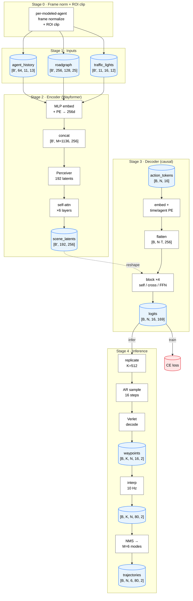

# MotionLM — Architecture Design Notes

> Living design doc. Anchored to MotionLM (Seff et al., Waymo, ICCV 2023, [arXiv 2309.16534](https://arxiv.org/abs/2309.16534)).
> Iterating with Claude. Confidence flags after each section.

---

## Conventions

| Symbol | Value | Meaning |
|---|---|---|
| `B` | — | scene batch |
| `N` | 1 or 2 | **modeled agents** — agents we predict trajectories for; 1 (marginal) / 2 (interactive) per WOMD task |
| `B'` | `B · N` | encoder runs **once per modeled agent** in that agent's reference frame; per-modeled-agent dim folded into batch |
| `A` | **64** | agent slots per pass (modeled agent at idx 0 + ≤63 nearest by distance at t=0) |
| `D_a` | **13** | per-agent-step feature dim (mask carries validity; see "Valid bit vs mask" note in Stage 1) |
| `T_past` | **11** | past + current steps @ 10 Hz, t = −1.0 … 0.0 s inclusive |
| `T = T_future` | **16** | prediction tokens @ 2 Hz (8 s = 80 future GT @ 10 Hz / 5) |
| ROI box | **`[−40, +120] × [−50, +50] m`** | agent-centric clip for roadgraph (160m × 100m); see Stage 0 |
| `R` | **256** | roadgraph chunk slots (post-ROI) |
| `P` | **128** | points per roadgraph chunk |
| `D_r` | **25** | per-roadgraph-point feature dim |
| `L` | **16** | traffic-light slots per timestep (nearest by proximity to modeled agent) |
| `D_tl` | **12** | per-traffic-light feature dim |
| `K` | 512 | inference rollout count |
| `M_modes` | 6 | output trajectory modes per agent (renamed from `M` to avoid clash with token count) |
| vocab | 169 | Verlet-wrapped action token vocab (13×13 over Δx, Δy bins) |
| `M` | **1136** | scene token count = `A·T_past + R + T_past·L = 64·11 + 256 + 11·16` |
| `latents` | **192** | Perceiver bottleneck (Wayformer main config) — M/latents = 5.92× compression |
| `d` | 256 | hidden dim throughout encoder/decoder (Wayformer) |
| `d_ff` | 1024 | FFN inner dim (Wayformer) |
| `heads` | 8 | attention heads (Wayformer) |
| `n_enc` | 6 | encoder self-attn layers (Wayformer; MotionLM paper-silent) |

**Modeled vs context agent**: a "modeled agent" gets its own decoder action-token stream and produces output trajectories. Context agents only feed the encoder — their motion shapes the scene latents the decoder cross-attends to, but no tokens are emitted for them.

---

## Stage 0 · Frame normalization & ROI clip (preprocessing)

Before any tensor is built, every input is transformed into the **modeled agent's reference frame**, then clipped to a Wayformer-style region of interest. This is what makes the small `R=256, A=64, L=16` budgets viable.

### Frame normalization

For each modeled agent (one per encoder pass):
1. Record its world-frame state at `t = current_time_index`: `(x₀, y₀, h₀)` (position and heading).
2. Subtract `(x₀, y₀)` from every world-frame `(x, y)` coordinate (agents, roadgraph points, TL stop_points).
3. Rotate by `−h₀` so the modeled agent points along `+x`.
4. Heading values: subtract `h₀` and wrap to `[−π, π]`.

After this transform the modeled agent sits at `(0, 0)` facing `+x` with heading `0`.

### ROI clip

Apply a fixed agent-centric box: **`[−40, +120] m × [−50, +50] m`** (160 m forward extent, 100 m lateral).

| Modality | What gets clipped | What gets kept |
|---|---|---|
| **roadgraph** | drop any MapPoint with `x' ∉ [−40, +120]` or `y' ∉ [−50, +50]` | the in-ROI subset is then chunked into ≤ R polylines (per feature, broken if needed) |
| **agents** | rank context agents by Euclidean distance to modeled agent at t=0; keep top `A−1 = 63` | the rest are dropped (their tokens never enter the encoder) |
| **traffic lights** | rank by Euclidean distance from each TL's `stop_point` to modeled agent at t=0; keep top `L = 16` per timestep | rest dropped |

### Why this makes a 4× smaller encoder feasible

Verified on 2,152 modeled-agent ROI passes across 496 scenes:

| | full scene | inside ROI | ratio |
|---|---|---|---|
| map points / scene | median 20,041 | median 7,952 / agent | ROI catches **~40%** |
| chunks at P=128 | (median 142 ROI chunks) | | R=256 → **96% coverage** |

Without ROI clipping, R=256 covers 13% of the map — the ROI clip is what makes the smaller budget viable.

---

## Tensor design rationale

All values verified against `uncompressed_scenario_training_training.tfrecord-00000-of-01000`. Detailed distributions live in the [Appendix](#appendix--verified-data-distributions).

### Time (`T_past = 11`, `T = 16`)

WOMD scenes are 9.0 s @ 10 Hz = **91 timestamps** with `current_time_index = 10`. Past + current = **11** (the +1 is the t=0 anchor frame); future GT = **80** steps, downsampled 5× → **T = 16** tokens @ 2 Hz.

### Agents (`A = 64`, `D_a = 13`)

| Choice | Why |
|---|---|
| `A = 64` | matches Wayformer main config; per-scene track count median 53 → A=64 covers ~60% of scenes without truncation; rest get **distance-ranked** dropping (far-away agents rarely affect the next 8 s) |
| modeled agent at idx 0 | A includes the modeled agent itself; in its own pass it has trivial values (x=0, y=0, h=0 at t=0) |
| `D_a = 13` | minimum useful set: 3 xyz + 2 sin/cos h + 2 vxy + 3 LWH + 3 type[3]. No explicit valid bit — the mask carries that signal; LWH + type already distinguish padding from real slots |
| keep z | rare (~4% scenes are multi-level) but disambiguates overpass/underpass; 1 dim is cheap |
| sin/cos h (vs raw) | avoids ±π discontinuity |
| 3-slot type | observed 89% VEHICLE / 10% PEDESTRIAN / 0.7% CYCLIST; no OTHER/UNSET in 13k tracks |

### Roadgraph (`R = 256`, `P = 128`, `D_r = 25`) — ROI-clipped

| Choice | Why |
|---|---|
| `R = 256` | matches Wayformer; viable only because of ROI clip — median 142 chunks needed for ROI-filtered points at P=128 |
| `P = 128` | bumped from Wayformer's ~20 to compensate for our smaller R; verified to give **96% modeled-agent coverage** at R=256 (R=256, P=80 = 86%; P=128 = 96%) |
| no downsampling | full 0.5 m point fidelity preserved within ROI |
| `D_r = 25` | 3 xyz + 2 dir + **20 fine-type one-hot**. No explicit valid bit — mask carries validity |
| 20-slot type | unified vocab across 7 MapFeature subtypes (LaneCenter ×4 + RoadLine ×9 + RoadEdge ×3 + StopSign + Crosswalk + SpeedBump + Driveway) — all observed |
| keep z | meaningful: range −1251 to +646 m, stdev 145 — multi-level intersections |
| stratified truncation | reserve ~25 chunks for rare subtypes (StopSign / Crosswalk / SpeedBump / Driveway); cap chunks-per-feature so one long LaneCenter can't dominate R |

### Traffic lights (`L = 16`, `D_tl = 12`)

| Choice | Why |
|---|---|
| `L = 16` | matches Wayformer; per-scene max ≤ 31 → ~82% coverage; rest get **proximity-ranked** dropping (far-away TLs don't affect the modeled agent's near-term motion) |
| time dim 11 | same past+current 10 Hz dim as agent_history (TL state changes within the 1 s window) |
| `D_tl = 12` | 3 xyz (stop_point, always present) + 9 state one-hot. No explicit valid bit — mask carries validity |
| 9-slot state | full LaneState enum: UNKNOWN, ARROW_STOP/CAUTION/GO, STOP, CAUTION, GO, FLASHING_STOP/CAUTION (8 of 9 observed; UNKNOWN is 22% — kept as own slot, not silently mapped) |
| drop `lane_id` | model infers TL→lane via spatial proximity (stop_point xyz vs lane centerlines) |

### Three-term agent glossary

| Term | Meaning | In a given encoder pass |
|---|---|---|
| **SDC** | Self-Driving Car (the AV that recorded the scene); `sdc_track_index` field | Appears as a context agent unless it happens to be the current pass's modeled agent |
| **Modeled agent** | One of `tracks_to_predict` for this pass | Index 0 |
| **Context / surrounding** | Everyone else, incl. the other modeled agent if `N=2` | Slots 1..A−1 |

---

## Data flow (figure)



---

## Stage-by-stage tensor shapes

### Stage 1 · Raw inputs (per modeled agent, post Stage 0 normalization & ROI clip)

| Tensor           | Shape                            |
| ---------------- | -------------------------------- |
| `agent_history`  | `[B', A=64, T_past=11, D_a=13]`  |
| `agent_mask`     | `[B', A=64, T_past=11]` bool     |
| `roadgraph`      | `[B', R=256, P=128, D_r=25]`     |
| `roadgraph_mask` | `[B', R=256, P=128]` bool        |
| `traffic_lights` | `[B', T_past=11, L=16, D_tl=12]` |
| `tl_mask`        | `[B', T_past=11, L=16]` bool     |

> **Valid bit vs mask**: the feature dims do *not* include an explicit "valid" channel. Validity is carried exclusively by the mask tensors (added to attention as `-∞` on invalid keys). Padding slots are distinguishable from real-zero slots via LWH + type one-hots, which are already zero for padding and non-zero for any real VEHICLE/map-point/TL. Single source of truth, no drift risk.

### Stage 2 · Wayformer encoder

Goal: turn the multi-modal Stage 1 inputs into **192 fixed-size latent tokens** the decoder can cross-attend to. Four substeps.

#### Step 2.1 · Per-modality embedders (three parallel mini-nets)

Each modality has its own embedder because input dim and natural "token unit" differ:

- **agents** — one token per `(agent, t)` pair; 2-layer MLP `D_a → d` applied pointwise
- **roadgraph** — one token per **chunk** (polyline); PointNet-style: per-point MLP `D_r → d` then **max-pool over P**
- **traffic lights** — one token per `(TL slot, t)`; 2-layer MLP `D_tl → d` pointwise

After the MLP each token gets **PE added in-place** (3 independent PE schemes: per-agent + sinusoidal time; per-chunk spatial; per-TL + same time PE) and a **3-way modality-type embedding** (one learned vector per modality, broadcast-added) so attention can tell them apart after concat.

| Tensor              | Shape                                | Notes                       |
| ------------------- | ------------------------------------ | --------------------------- |
| `agent_tokens`      | `[B', A·T_past=704, d=256]`          | flatten of `[B', A, T_past]` |
| `roadgraph_tokens`  | `[B', R=256, d=256]`                 | P-axis collapsed by max-pool |
| `tl_tokens`         | `[B', T_past·L=176, d=256]`          | flatten of `[B', T_past, L]` |

#### Step 2.2 · Concat → scene token sequence

Stack the three modality outputs along the token axis. The flat mask `[B', M]` is stacked the same way from Stage 1's three masks.

| Tensor          | Shape                          | Notes                                          |
| --------------- | ------------------------------ | ---------------------------------------------- |
| `scene_tokens`  | `[B', M=1136, d=256]`          | `M = A·T_past + R + T_past·L = 704+256+176`    |
| `scene_mask`    | `[B', M=1136]` bool            | flat concat of `agent_mask`, `rg_mask`, `tl_mask` |

#### Step 2.3 · Perceiver cross-attn (input compression)

The trick that decouples decoder cost from `M`. Learned latent queries cross-attend to all scene tokens (typically 1 cross-attn layer, multi-head).

- Q: `[B', latents=192, d=256]` — broadcast of a learned `[192, d]` parameter
- K, V: `scene_tokens [B', M=1136, d=256]`, masked by `scene_mask`
- Output: each of the 192 latents has aggregated info from all 1136 scene tokens
- **Compression ratio**: M / latents = 1136 / 192 ≈ **5.92×** — matches Wayformer's main config exactly

| Tensor             | Shape                                | Notes                              |
| ------------------ | ------------------------------------ | ---------------------------------- |
| `latents_init`     | `[B', latents=192, d=256]`           | post cross-attn; M dim is gone     |

#### Step 2.4 · Self-attn × n_enc layers (transformer over latents)

Standard transformer encoder blocks operating on the now-fixed 192-token sequence:

- per layer: multi-head self-attn (`heads=8`) → FFN (`d_ff=1024`) → residual + layernorm
- **`n_enc = 6` layers** — matches Wayformer (MotionLM paper-silent)
- Shape unchanged throughout

| Tensor          | Shape                          | Notes                                    |
| --------------- | ------------------------------ | ---------------------------------------- |
| `scene_latents` | `[B', latents=192, d=256]`     | encoder output; consumed by Stage 3 cross-attn |

### Stage 3 · Causal decoder

Joint multi-agent action-token decoder. Numbers below use **N=2** (interactive case) for concreteness.

#### Step 3.0 · What goes in

| Tensor | Shape | Source |
|---|---|---|
| `action_tokens` | `[B, N=2, T=16]` int (∈ 0..168) | training: GT tokens shifted right by 1 with BOS; inference: previously sampled tokens |
| `scene_latents` | `[B·N=2B, 192, 256]` | Stage 2 output — one set per modeled agent |

#### Step 3.1 · Token embed + positional encodings

Three additive components:

- **Embedding table lookup**: `[vocab=169, d=256]` parameter; `tokens [B, N, T] → [B, N, T, 256]`
- **Timestep PE** (sinusoidal): one per `t ∈ [0..15]`, broadcast across batch and agent
- **Agent PE** (learned): one per slot in `[0..N−1]`, broadcast across batch and time

| Tensor | Shape | Notes |
|---|---|---|
| `tok_emb` | `[B, N=2, T=16, d=256]` | sum of three components |

#### Step 3.2 · Flatten & route scene latents

The decoder operates on the **joint** action sequence so block-staircase masking can let agents see each other at past times. So we flatten the `(N, T)` axes into one length-32 sequence.

For cross-attn routing, `scene_latents` are reshaped per-batch with the agent dim explicit, so each token can be routed to its own agent's latents.

| Tensor | Shape | Notes |
|---|---|---|
| `x` | `[B, N·T=32, d=256]` | flattened action embeddings |
| `kv` | `[B, N=2, latents=192, d=256]` | scene_latents reshaped from `[B·N, 192, 256]` |

#### Step 3.3 · Decoder block × 4

Each block is **(self-attn → cross-attn → FFN)** with residual + LN around each sub-layer.

##### 3.3a · Causal self-attn (block-staircase mask)

The interesting piece. Joint multi-agent decoding requires a mask where token `(agent_a, time_t)` can attend to token `(agent_b, time_s)` **iff** `s ≤ t` — including same-time other-agent tokens. This is what makes it joint instead of marginal.

```
        a0  a1            ← time 0
   ┌──┬──┐
a0 │ ✓│ ✓│
a1 │ ✓│ ✓│
   ├──┼──┼──┬──┐         ← time 1
a0 │ ✓│ ✓│ ✓│ ✓│
a1 │ ✓│ ✓│ ✓│ ✓│
   ├──┼──┼──┼──┼──┬──┐   ← time 2
a0 │ ✓│ ✓│ ✓│ ✓│ ✓│ ✓│
a1 │ ✓│ ✓│ ✓│ ✓│ ✓│ ✓│
   └──┴──┴──┴──┴──┴──┘
```

Each "step" of the staircase is an `N×N` block (all agents see each other within that timestep).

| Tensor | Shape |
|---|---|
| Q, K, V | `[B, 32, 256]` — same `x`, projected |
| attn output | `[B, 32, 256]` — added to residual `x` |

##### 3.3b · Cross-attn to scene_latents

Each token attends to **its own agent's** scene_latents (per the route in 3.2). This is one of our open questions — the alternative is to pool all N agents' latents into `[B, N·192, 256]` and let everyone see everything.

| Tensor | Shape |
|---|---|
| Q | `[B, 32, 256]` (from previous sub-layer) |
| K, V | `[B, N=2, 192, 256]` — token at agent `a` queries slice `kv[:, a, :, :]` |
| attn output | `[B, 32, 256]` |

##### 3.3c · FFN

Standard 2-layer: `Linear(256 → 1024) → GELU → Linear(1024 → 256)`.

Output of block: `[B, 32, 256]`, fed to next block. **×4 blocks total** (paper-cited).

#### Step 3.4 · Output projection

| Step | Shape | Notes |
|---|---|---|
| Unflatten | `[B, N=2, T=16, d=256]` | undo the join |
| Output linear `d → vocab` | `[B, N=2, T=16, vocab=169]` | per-position logits over the 169-token Verlet vocab |

#### Step 3.5 · Training loss (cross-entropy)

Training uses **teacher-forcing** — the decoder sees the GT action sequence shifted right by 1 and predicts the un-shifted sequence in one parallel forward pass (not AR).

**Target preparation** (done once per training scene, offline or as a data-loader op):
1. Take each modeled agent's GT future trajectory at 10 Hz: `[T_future=80, xy=2]` in world frame.
2. Inverse-transform to agent-centric frame using `(x₀, y₀, h₀)` (same as Stage 0).
3. Downsample 5× → 16 GT positions @ 2 Hz.
4. **Verlet-quantize** (inverse of Step 4.3): convert each (pos_t, pos_{t-1}, pos_{t-2}) triple into a token via greedy nearest-bin lookup over the 13×13 Δ-of-Δ grid.
5. Result: `gt_tokens [B, N, T=16]` int (∈ 0..168).

**Decoder input vs output alignment** (standard AR teacher-forcing):

| Position | Input token | Output prediction target |
|---|---|---|
| 0 | `BOS` | `gt_tokens[0]` |
| 1 | `gt_tokens[0]` | `gt_tokens[1]` |
| ... | ... | ... |
| 15 | `gt_tokens[14]` | `gt_tokens[15]` |

So the decoder's input is `[BOS, gt_tokens[0..14]]` (length 16) and its output logits `[B, N, T=16, vocab=169]` are matched 1-for-1 against `gt_tokens[0..15]`.

**Loss**: standard token-level cross-entropy, masked by future-validity:

```
ce[b, n, t]   = −log softmax(logits[b, n, t, :])[gt_tokens[b, n, t]]
mask[b, n, t] = future_validity_at_2Hz[b, n, t]
loss          = (ce * mask).sum() / mask.sum()
```

| Tensor | Shape | Notes |
|---|---|---|
| `logits` | `[B, N=2, T=16, vocab=169]` | from Step 3.4 |
| `gt_tokens` | `[B, N=2, T=16]` int | Verlet-quantized GT |
| `future_validity` | `[B, N=2, T=16]` bool | 1 if GT exists at 10 Hz step `t·5` (agent still in scene) |
| `loss` | scalar | mean CE over valid positions |

**Notes on the loss design** (paper-cited where flagged):
- **Pure CE per token** — no per-mode weighting, no per-timestep weighting. Diversity comes from sampling at inference (Stage 4.2), not from a multi-mode supervised head.
- **Joint masking** — for `N=2` (interactive), both agents' tokens get equal weight; an agent's contribution is gated only by its own future-validity (an early-exiting agent doesn't penalize the other).
- **No auxiliary regression loss** on positions — the model is purely a discrete language model over the Verlet vocab. Position errors only manifest through the quantization granularity (~3 m per axis at 2 Hz).
- **Block-staircase mask is active during training** — same mask as inference Step 3.3a, so training and inference attention patterns match exactly.

#### Inference path (overview)

The same decoder runs in autoregressive mode for inference — see Stage 4 for the full rollout-and-aggregation pipeline.

#### Attention kernel

Both SA and CA use a small `MultiheadSDPA` wrapper over
`F.scaled_dot_product_attention` (see `model/motion_decoder.py`) rather than
`nn.MultiheadAttention`. Under bf16/fp16 autocast this dispatches to
FlashAttention / mem-efficient kernels. Mask conventions are preserved
(bool `True = blocked` for attn_mask, `True = pad` for key_padding_mask) —
inverted inside the wrapper to match SDPA's `True = attend` convention.

#### Cost note (per training pass, dominant ops)

| Sub-layer | Ops per layer | ×4 blocks |
|---|---|---|
| Self-attn `32²·8·256` | ~2M | 8M |
| Cross-attn `32·192·8·256` | ~12.6M | 50M |
| FFN `32·256·1024·2` | ~17M | 68M |

**Cross-attn dominates** — and it's called K=512 times during inference. This is why latents=192 (instead of latents=512) really matters: every halving of latents halves the inference cost.

### Stage 4 · Inference

Joint multi-agent rollout sampling, decoding, and aggregation. Numbers below use **N=2, K=512, T=16, T_future=80, M_modes=6, latents=192**.

#### Step 4.0 · What goes in

| Tensor | Shape | Source |
|---|---|---|
| `scene_latents` | `[B·N, 192, 256]` | Stage 2 output, one set per modeled agent |
| `(x₀, y₀, h₀)` per agent | `[B, N, 3]` | Stage 0's saved frame-normalization params (needed in Step 4.5) |
| sampling τ | scalar | temperature for next-token sampling (paper-silent — typical τ ≈ 1.0) |

#### Step 4.1 · Replicate to K=512 rollouts

Tile `scene_latents` along a new K axis. KV cache for the decoder's self-attn gets allocated per (B, K) and shared across all 16 AR steps.

| Tensor | Shape | Notes |
|---|---|---|
| `scene_latents_rep` | `[B·K, N, 192, 256]` | tiled along K |
| `kv_cache` (self-attn, per layer) | `[B·K, N·T_max=32, d=256]` × 4 layers | grows as AR proceeds; pre-allocated |

**Cost trick**: scene_latents_rep is 512× the size of scene_latents but the encoder doesn't run again — encoder work amortizes over all K rollouts.

#### Step 4.2 · Autoregressive sample × T=16 steps (sequential within step)

The decoder loop. At each step `t`, agents are sampled **one at a time** so that later agents can condition on earlier agents' just-sampled tokens — this is what recovers the true joint `P(a₀_t, a₁_t | history)` instead of the factored product `P(a₀_t)·P(a₁_t)`. See the block-staircase rationale and the intersection example in [Iteration log](#iteration-log) (2026-04-18 entry on Option B).

With a KV cache the decoder input is just **1 new token** per inner step. The cache holds all previously sampled K/V.

```
init: tokens[:, :, :, 0] = BOS                                          # [B, K, N, 1]
      cache = empty                                                     # [B·K, 0, d] × 4 layers
for t in 0..15:                                                         # outer: time
    for a in 0..N-1:                                                    # inner: agent (sequential)
        new_input = tokens[:, :, a:a+1, t:t+1]                          # [B, K, 1, 1]
        logits, cache = decoder(new_input, scene_latents_rep, cache)    # cache grows by 1 token
        # logits shape: [B, K, 1, 1, vocab=169]
        next_tok = sample(logits[..., 0, :] / τ)                        # [B, K, 1]
        tokens[:, :, a, t+1] = next_tok
```

Total inner sampling rounds: `T · N = 16 · 2 = 32` per scene per rollout.

Cache and cost progression — each inner sub-step adds 1 token:

| outer step `t` | inner step `a` | new input | cache size after |
|---|---|---|---|
| 0 | 0 | `[B, K, 1, 1]` (BOS for agent 0) | `[B·K, 1, d]` |
| 0 | 1 | `[B, K, 1, 1]` | `[B·K, 2, d]` |
| 1 | 0 | `[B, K, 1, 1]` | `[B·K, 3, d]` |
| 1 | 1 | `[B, K, 1, 1]` | `[B·K, 4, d]` |
| ... | ... | ... | ... |
| 15 | 1 | `[B, K, 1, 1]` | `[B·K, 32, d]` |

Per inner sub-step cost:
- **self-attn**: 1 new Q × cached K/V (length grows from 1 to 32) × d × heads
- **cross-attn**: 1 new Q × `192` latents × d × heads — **constant per sub-step**
- **FFN**: applied only to the 1 new token

| Tensor | Shape | Notes |
|---|---|---|
| `sampled_tokens` | `[B, K=512, N=2, T=16]` int (∈ 0..168) | accumulated over all 32 inner sub-steps |

**Contrast with training**: in teacher-forcing (Step 3.5), the decoder gets the full `[B, N, T=16]` input in one parallel pass — no KV cache, no loop, all 32 logits computed together, masked by the same block-staircase pattern. Per-token attention pattern is identical between train and infer; only the schedule differs.

**Cost vs Option A (parallel within step)**: Option B does `T·N = 32` sub-steps; Option A would do only `T = 16`. So Option B is roughly 2× the sampling rounds for `N=2`. Acceptable given correctness gain (no spurious collisions; recovers true joint distribution).

**Open knobs** (paper-silent): temperature τ, optional top-k / top-p truncation, agent ordering within a step (currently `0..N-1`; could also use distance-to-modeled-agent or speed-based ordering).

#### Step 4.3 · Verlet decode (tokens → waypoints @ 2 Hz)

Each token is a Δ-of-Δ-bin index in the 13×13 Verlet grid. Decode sequentially per agent:

```
pos₀ = (0, 0)                           # agent-centric origin
bin₀ = (0, 0)                           # assume zero initial velocity
for t in 0..15:
    bin_t = bin_{t-1} + offset(token_t)         # token 0 = "repeat", non-zero = Δ-bin shift
    pos_t = pos_{t-1} + bin_to_delta(bin_t)     # accumulate physical Δ to absolute position
```

Bin → physical Δ map: each bin is a step of `±18 m / 6 ≈ ±3 m` per axis at 2 Hz, covering speeds up to ~80 mph.

| Tensor | Shape | Notes |
|---|---|---|
| `waypoints_2hz` | `[B, K=512, N=2, T=16, xy=2]` | absolute (x, y) in agent-centric frame |

#### Step 4.4 · Spline interp 2 Hz → 10 Hz

WOMD requires submissions at 10 Hz × 8 s = **80 waypoints**. Upsample each rollout's 16 waypoints to 80 using cubic spline (or linear — paper-silent).

| Tensor | Shape | Notes |
|---|---|---|
| `waypoints_10hz` | `[B, K=512, N=2, T_future=80, xy=2]` | still in agent-centric frame |

#### Step 4.5 · Inverse frame transform (agent-centric → world)

Reverse Stage 0's normalization. For each agent, rotate by `+h₀` and translate by `+(x₀, y₀)`:

```
x_world = x_agent · cos(h₀) - y_agent · sin(h₀) + x₀
y_world = x_agent · sin(h₀) + y_agent · cos(h₀) + y₀
```

| Tensor | Shape | Notes |
|---|---|---|
| `waypoints_world` | `[B, K=512, N=2, T_future=80, xy=2]` | world-frame coordinates ready for evaluation |

#### Step 4.6 · Greedy NMS aggregation → M_modes=6

K=512 candidate trajectories per agent collapsed into 6 modes with probabilities for WOMD submission.

```
# per agent:
score[k] = product over t of P(token_k_t | history)         # joint sample prob
sorted = sort rollouts by score descending
modes = []
for k in sorted:
    if dist(traj_k, any traj in modes) > threshold:
        modes.append(traj_k)
        if len(modes) == M_modes=6: break
prob[m] = (#rollouts that clustered to mode m) / K          # empirical density
```

| Tensor | Shape | Notes |
|---|---|---|
| `trajectories` | `[B, N=2, M_modes=6, T_future=80, xy=2]` | top-6 modes, world-frame |
| `probs` | `[B, N=2, M_modes=6]` | aggregated mode probabilities, sum to 1 per agent |

**Open knobs** (in open questions list):
- distance metric — endpoint L2? full-trajectory L2? per-timestep L2?
- threshold value
- scoring — joint sample probability vs max single-token prob vs sum-of-cluster

#### Cost note

Inference dominates at the AR loop (Step 4.2): the decoder runs 16 times per scene per rollout, K=512 rollouts. Cross-attn over 192 latents at every step is the main cost — exactly why `latents=192` (vs 256 or 512) was the key knob to get right.

---

## Action vocabulary (Verlet)

- Per-step interval **±18 m** at 2 Hz (covers ~80 mph axis-aligned)
- **128 raw bins per coord → wrap → 13 bins per coord → 13×13 = 169 joint tokens**
- Verlet wrapping: predict **delta of delta-bin index**
  - token 0 = "repeat previous Δ-bin"
  - non-zero token = signed offset to previous Δ-bin
- Decode: `bin_t = bin_{t−1} + offset(token_t)`, then `pos_t = pos_{t−1} + bin_to_delta(bin_t)`
- Targets: greedy quantization of GT waypoints

---

## Data pipeline · Converter & dataloader

PyTorch-native preprocessing and streaming of WOMD scenarios into model-ready tensors. Offline converter bakes in Stage 0 normalization + Verlet tokenization; online dataloader streams, shuffles, and densifies sparse examples on the fly.

### Scope

- **Task**: marginal (N=1). Interactive (N=2) deferred.
- **Source**: `uncompressed_scenario_training_training.tfrecord-{00000..00999}` (1000 files × **496 scenarios/file** × ~4.34 modeled agents).
- **Output**: ~910 sharded `.pt.zst` files, **≤ 100 GB total**.
- **Framework**: PyTorch (`IterableDataset` + `DataLoader`).
- **Augmentation**: none initially.

### Example filters (applied at convert time)

| Filter | Kept fraction | Reason |
|---|---|---|
| `object_type == VEHICLE` | 89% | pedestrians and cyclists have different motion statistics; start with vehicles |
| `valid future steps ≥ 4` | 95% | avoid examples where the modeled agent exits almost immediately |
| **Combined** | **~85%** | **~1.82M final examples** |

### Shard layout — one tfrecord → one shard

```
uncompressed_scenario_training_training.tfrecord-NNNNN  →  shard_NNNNN.pt.zst
```

Roughly **910 shards × ~110 MB = ~100 GB**. Variable count per shard (~1700–2000 examples after filtering) is fine — the dataloader doesn't care.

### Shard file schema

Each `shard_NNNNN.pt.zst` is a zstd-compressed `torch.save` of a dict. Examples are stored **sparsely** (only non-padded slots) with type indices instead of one-hot expansions to minimize disk.

```python
{
    "version": 1,
    "count": n_examples,                         # ~1700–2000 after filtering
    "examples": [
        {
            # --- roadgraph (sparse; one entry per valid point) ---
            "rg_xyz":       fp16 [n_rg, 3],
            "rg_dir":       fp16 [n_rg, 2],
            "rg_type":      int8 [n_rg],         # 0..19 subtype index
            "rg_chunk_idx": int16 [n_rg],        # ∈ 0..R-1 = 0..255
            "rg_point_idx": int8  [n_rg],        # ∈ 0..P-1 = 0..127

            # --- agents (sparse; one entry per valid (slot, time)) ---
            "ag_feats":     fp16 [n_ag, 11],     # xyz + sin/cos h + vxy + LWH
            "ag_type":      int8 [n_ag],         # 0..2 (VEHICLE/PEDESTRIAN/CYCLIST)
            "ag_slot":      int8 [n_ag],         # ∈ 0..A-1 = 0..63; slot 0 = modeled
            "ag_time":      int8 [n_ag],         # ∈ 0..T_past-1 = 0..10

            # --- traffic lights (sparse; one entry per valid (time, slot)) ---
            "tl_feats":     fp16 [n_tl, 3],      # stop_point xyz in agent frame
            "tl_state":     int8 [n_tl],         # 0..8 LaneState index
            "tl_slot":      int8 [n_tl],         # ∈ 0..L-1 = 0..15
            "tl_time":      int8 [n_tl],         # ∈ 0..T_past-1 = 0..10

            # --- training targets ---
            "gt_tokens":    int16 [T=16],        # ∈ 0..168 Verlet vocab
            "future_valid": uint8 [2],           # 16 bits packed for T=16

            # --- metadata (for un-normalization / WOMD submission) ---
            "x0":           fp32,
            "y0":           fp32,
            "h0":           fp32,
            "scenario_id":  bytes [16],
            "track_id":     int32,
        },
        ...
    ],
}
```

### Storage budget (per example)

| Component | Dense fp32 | + fp16 + sparse + int8 types | + zstd |
|---|---|---|---|
| roadgraph | 3,328 KB | 137 KB | ~55 KB |
| agent_history | 39 KB | 12 KB | ~6 KB |
| traffic_lights | 9 KB | 2.5 KB | ~1.2 KB |
| masks | 36 KB | (implicit in sparse) | ~2 KB |
| targets + meta | 0.3 KB | — | ~0.3 KB |
| **Total per example** | **~3.4 MB** | **~155 KB** | **~65 KB** |

1.82M × 65 KB ≈ **115 GB**. Push to ≤ 100 GB by raising zstd level from 6 → 9 (~10% extra compression; slower but one-time cost).

### Converter design (offline, embarrassingly parallel)

One process per tfrecord. No cross-file state. Target wall-clock: 2–4 hours across 8–16 CPU workers.

```python
def convert_tfrecord(tfrecord_path: Path, shard_path: Path):
    examples = []
    for scenario in read_scenarios(tfrecord_path):              # 496 per file
        tracks              = parse_tracks(scenario)
        map_features        = parse_map_features(scenario)
        dynamic_map_states  = parse_dynamic_map_states(scenario)
        cti                 = scenario.current_time_index        # =10 on WOMD

        for tidx in scenario.tracks_to_predict:
            track = tracks[tidx]
            if track.object_type != VEHICLE:         continue    # filter 1
            if count_valid_future(track, cti) < 4:   continue    # filter 2

            (x0, y0, h0) = get_state(track, cti)

            ex = {
                **build_agents_sparse(tracks, tidx, cti, x0, y0, h0),
                **build_roadgraph_sparse(map_features, x0, y0, h0, roi=ROI_BOX),
                **build_traffic_lights_sparse(dynamic_map_states, x0, y0, h0),
                **build_targets(track, cti, x0, y0, h0),
                "x0": x0, "y0": y0, "h0": h0,
                "scenario_id": scenario.scenario_id.encode(),
                "track_id":    track.id,
            }
            examples.append(ex)

    shard = {"version": 1, "count": len(examples), "examples": examples}
    save_zstd(shard_path, shard, level=9)
```

Helper functions encapsulate Stage 0 logic:

- `build_agents_sparse` — rank context agents by distance at t=0, keep top 63 + modeled at slot 0, extract 11 past states, transform to agent frame, emit sparse triples
- `build_roadgraph_sparse` — transform all map points to agent frame, ROI-clip, chunk per feature at P=128, stratified-truncate to R=256, emit sparse triples
- `build_traffic_lights_sparse` — per timestep, rank TLs by proximity to modeled agent, keep top L=16, emit sparse triples
- `build_targets` — extract GT future (t=11..90), downsample 5× to 16 waypoints @ 2 Hz, transform to agent frame, Verlet-quantize → int16 tokens + future-valid bitmask

### Dataloader design (online)

```python
class MotionLMShardDataset(IterableDataset):
    def __init__(self, shard_paths: list[Path], shuffle_buffer: int = 8192):
        self.shards = shard_paths
        self.shuffle_buffer = shuffle_buffer

    def __iter__(self):
        worker = torch.utils.data.get_worker_info()
        my_shards = self.shards[worker.id::worker.num_workers] if worker else self.shards
        random.shuffle(my_shards)                                # per-epoch shard order

        # IMPORTANT: buffer holds SPARSE examples (~65 KB each), densify on
        # yield. A dense example is ~3.4 MB (the R·P·D_r roadgraph tensor
        # dominates), so buffering dense would be ~27 GB/worker at 8192 — an
        # instant host-RAM OOM once num_workers>1.
        buf: list[dict] = []
        for shard_path in my_shards:
            shard = load_zstd(shard_path)
            examples = shard["examples"]
            random.shuffle(examples)                             # within-shard shuffle
            for ex in examples:
                buf.append(ex)
                if len(buf) >= self.shuffle_buffer:
                    random.shuffle(buf)
                    for _ in range(len(buf) // 2):               # drain half, refill
                        yield densify(buf.pop())
        random.shuffle(buf)
        while buf:
            yield densify(buf.pop())


def densify(ex: dict) -> dict:
    """Sparse (disk) → dense (model-ready) tensors. Validity is carried only by the mask."""
    ah = torch.zeros(64, 11, 13);  am = torch.zeros(64, 11, dtype=torch.bool)
    rg = torch.zeros(256, 128, 25); rm = torch.zeros(256, 128, dtype=torch.bool)
    tl = torch.zeros(11, 16, 12);   tm = torch.zeros(11, 16, dtype=torch.bool)

    # agents: scatter 10 feature cols + expand 3-slot type one-hot
    ah[ex["ag_slot"], ex["ag_time"], 0:10]  = ex["ag_feats"].float()
    ah[ex["ag_slot"], ex["ag_time"], 10:13] = F.one_hot(ex["ag_type"].long(), 3).float()
    am[ex["ag_slot"], ex["ag_time"]] = True

    # roadgraph: scatter 5 feature cols + expand 20-slot type one-hot
    rg[ex["rg_chunk_idx"], ex["rg_point_idx"], 0:3]  = ex["rg_xyz"].float()
    rg[ex["rg_chunk_idx"], ex["rg_point_idx"], 3:5]  = ex["rg_dir"].float()
    rg[ex["rg_chunk_idx"], ex["rg_point_idx"], 5:25] = F.one_hot(ex["rg_type"].long(), 20).float()
    rm[ex["rg_chunk_idx"], ex["rg_point_idx"]] = True

    # TLs: scatter 3 feature cols + expand 9-slot state one-hot
    tl[ex["tl_time"], ex["tl_slot"], 0:3]  = ex["tl_feats"].float()
    tl[ex["tl_time"], ex["tl_slot"], 3:12] = F.one_hot(ex["tl_state"].long(), 9).float()
    tm[ex["tl_time"], ex["tl_slot"]] = True

    return {
        "agent_history":  ah, "agent_mask":     am,
        "roadgraph":      rg, "roadgraph_mask": rm,
        "traffic_lights": tl, "tl_mask":        tm,
        "gt_tokens":    ex["gt_tokens"].long(),
        "future_valid": unpack_bits(ex["future_valid"])[:16].bool(),
        "x0": ex["x0"], "y0": ex["y0"], "h0": ex["h0"],
        "scenario_id": ex["scenario_id"], "track_id": ex["track_id"],
    }


# usage
loader = DataLoader(
    MotionLMShardDataset(train_shards),
    batch_size=32, num_workers=8, prefetch_factor=4, pin_memory=True,
)
```

### Configuration summary

| Knob | Value | Reason |
|---|---|---|
| Filters | `VEHICLE` only + future_valid ≥ 4 | ~0.85× retention; ~1.82M examples |
| Sharding | 1 tfrecord → 1 shard | ~910 shards, ~110 MB each |
| Compression | zstd level 9 | ~4× vs dense fp16-sparse, total ≤ 100 GB |
| Shuffle buffer | 8,192 **sparse** examples | ~65 KB/item → ~530 MB/worker; buffering dense would be ~27 GB/worker |
| DataLoader workers | 8 | typical training-server core count |
| Prefetch factor | 4 | hides shard decompression latency |
| Batch size | 32 (tunable) | ~65 batches per shard |

### Smoke test plan

Before launching the full 1000-file conversion:

1. Run converter on `tfrecord-00000` → one shard (~110 MB).
2. Load with the dataloader, pull 10 batches, assert shapes match the Stage 1 contract.
3. Run **one training step** end-to-end (forward + loss + backward).
4. If all green, launch full conversion across all 1000 files.

---

## Training performance notes

Measured on one RTX 5080 (16 GB), 10.81M params, one shard of WOMD training
(bf16 + SDPA default config):

| batch | ckpt? | step (ms) | samples/s | peak GPU |
|---|---|---|---|---|
| 16 | no | 42.8 | 373 | 4.0 GB |
| 32 | no | 73.7 | 434 | 7.8 GB |
| **48** | **no** | **105.9** | **453** | **11.5 GB** |
| 64 | yes + expandable_segments | 177.1 | 361 | 15.3 GB |

Per-step breakdown at batch=16:

| Phase | Time | % of step |
|---|---|---|
| data (loader) | 0.1 ms | <1% |
| h2d copy | 1.4 ms | 3% |
| forward | 12.1 ms | 28% |
| **backward** | **26.9 ms** | **63%** |
| optimizer | 2.2 ms | 5% |
| **total** | **42.8 ms** | — |

Backward dominates; the data loader is never the bottleneck (workers prefetch
shards end-to-end in <0.2 ms). Epoch ≈ **82 min at batch=48** (2.24M examples).

### Knobs exposed in `training/train.py`

| Flag / cfg field | Implementation | When it helps |
|---|---|---|
| `--amp` | `torch.amp.autocast(dtype=torch.bfloat16)` — no `GradScaler`. bf16 shares fp32's exponent range, so CE loss over 169 logits can't overflow. | Always on — same speed as fp16 with simpler code. |
| SDPA attention (default) | `MultiheadSDPA` (`model/attention.py`) routes all decoder attention **and** encoder Perceiver CA + 6 self-attn layers through `F.scaled_dot_product_attention`. | Always on. **FlashAttention fires** on all mask-free attentions (verified via `torch.nn.attention.sdpa_kernel`). Decoder SA falls back to mem-efficient because the block-staircase mask isn't pure causal (can't use `is_causal=True`). |
| `--compile` | `torch.compile(model)` after `.to(device)`; checkpoint save unwraps `_orig_mod`. | Currently neutral at 11M params (compile warmup ≈ 60 s, steady-state gain < 1%). Re-benchmark if the model scales past ~50M params or the inference loop gets compiled. |
| `--grad-ckpt` (→ `cfg.grad_checkpoint`) | Checkpoints **every** expensive block when training: each decoder block, each encoder self-attn block, the Perceiver CA, and all 3 per-modality embedders (`_embed_agents`, `_embed_roadgraph`, `_embed_tl`). The roadgraph embedder is the important one — its hidden activation at B=64 is `B·R·P·d_ff = 64·256·128·1024·2 B ≈ 4.3 GB`. | Only useful if you *need* batch ≥ 64 (e.g. gradient-noise reasons). On 16 GB, batch=48 without ckpt beats batch=64 with ckpt (453 > 361 samples/s). |

### FlashAttention dispatch (verified under bf16)

| Attention site | Mask | Kernel |
|---|---|---|
| Decoder self-attn | block-staircase bool (`t_k ≤ t_q`, all agents same-t allowed) | mem-efficient (Flash rejected: not `is_causal`) |
| Decoder cross-attn | none | **Flash** |
| Encoder Perceiver CA (192 ← 1136) | `key_padding_mask` (bool) | **Flash** (no attn_mask) |
| Encoder self-attn over 192 latents | none | **Flash** |

### Unattended multi-epoch runs

`training/train_multi_epoch.py` wraps `train.py`'s single-epoch loop with
end-of-epoch checkpoint + eval so a full run can survive a crash with at most
one epoch of lost work:

```
<out_dir>/
  log.jsonl                    # one "run_meta" line + one "epoch" line per epoch
  checkpoints/epoch_NN.pt
```

Each `epoch` JSONL line carries `mean_train_loss`, `last_train_loss`, the
checkpoint path, and the full eval summary (val CE, token acc, minADE/minFDE/MR
at 3/5/8 s). Because `MotionLMShardDataset` is an `IterableDataset` with no
natural `__len__`, one "epoch" is defined by `--steps-per-epoch`;
`steps × batch ≈ |train set|` approximates a true pass (46000 × 48 ≈ 2.21M ≈
dataset size).

### Evaluation

`training/evaluate.py` computes a subset of the WOMD 2025 interaction-prediction
metrics on a validation split:

| Reported | Skipped |
|---|---|
| Val CE loss + perplexity (teacher-forced) | Soft mAP — needs intent bucketing |
| Token top-1 accuracy | Overlap Rate — needs N=2 joint |
| minADE / minFDE @ 3 / 5 / 8 s | |
| Miss Rate @ 3 / 5 / 8 s (WOMD speed-scaled thresholds) | |

Speed-scaling: threshold × 0.5 at <1.4 m/s, × 1.0 at >11 m/s, linear between;
speed read from slot-0 `ag_feats[..., 5:7]` at `t = T_past-1`.

Miss-rate lat/long projection uses the **initial agent frame** (t=0 heading = +x),
exact for straight paths and approximate for turns. WOMD's reference impl
projects at each evaluation timestep's heading — a plug-in upgrade.

Throughput on RTX 5080: ~25 samples/s at K=64, ~6 samples/s at K=512 (Stage-4 AR
cost scales linearly in K). Typical dev-loop usage: `--max-samples 512 --K 64`
for a sub-30-s sanity check during training; full val at K=512 is reserved for
paper-number reproductions.

See the [README §Evaluation](../README.md#evaluation) for CLI flags and sample
output.

### Where further gains would come from

- **Flatten time outer, agent inner** in the decoder (`idx = t·N + a`) and
  drop the bool mask in favor of `is_causal=True` *if* you switch to Option B
  semantics (sequential-within-step joint). That would let Flash fire on
  decoder SA too. Current layout (agent outer) was chosen because training
  teacher-forces all agents at the same t in parallel, which needs the
  block-staircase mask — not strict causal.
- **`torch.compile`** pays off on bigger fused-kernel budgets. Re-visit when
  the model grows or when inference latency becomes the focus (the Stage 4 AR
  loop is called `T·N = 32` times per rollout; compile gains compound).
- **Fused AdamW** (`torch.optim.AdamW(fused=True)` on CUDA) is a free 0.5–1 ms
  — noise here, but worth enabling at smaller batches.

## Confidence flags

| Claim | Confidence |
|---|---|
| N=1/2, T=16, vocab=169, Verlet 13×13, decoder 4×256 (4h, FFN=1024), block-staircase mask, K=512, M_modes=6 | **paper-cited** (Appendix A & B) |
| Wayformer encoder structure (per-modality MLP → concat → Perceiver → self-attn), `d=256, d_ff=1024, heads=8, n_enc=6, latents=192, A=64, R=256, L=16` | from [Wayformer (arXiv 2207.05844)](https://arxiv.org/abs/2207.05844) main config — MotionLM paper-silent on encoder hyperparams |
| ROI box `[−40, +120] × [−50, +50]`, `P=128` | **design choices** — ROI sized for 8s × 30 m/s highway forward range; P=128 picked as smallest value giving ≥95% modeled-agent ROI coverage at R=256 (verified, see Appendix) |
| `D_a=13, D_r=25, D_tl=12` (no explicit valid channel; mask-only) | **design choices** — derived from WOMD distribution + verified field structure (see Appendix). Paper-silent. |

---

## Open design questions

- [ ] Surrounding-agent ranking — currently Euclidean at t=0; should we use TTC, lane-graph proximity, or trajectory-overlap instead?
- [ ] TL ranking — Euclidean to modeled agent, or restrict to TLs whose lane is on the modeled agent's planned path?
- [ ] ROI box — currently fixed `[−40,+120] × [−50,+50]`; should it scale with modeled agent's speed (longer forward extent at highway speeds)?
- [ ] Cross-attn routing — each token attends to its own agent's 192 latents, or to all N agents pooled?
- [ ] Inference temperature τ and top-k/top-p
- [ ] NMS clustering distance metric — endpoint? full-trajectory L2? per-timestep similarity?
- [ ] Loss weighting — pure CE per token, or weighted by timestep / mode probability?
- [ ] Mid-future agent invalidity (occlusion, leaving scene)

---

## Iteration log

- 2026-04-18: Doc created from ICCV paper + Wayformer cross-references.
- 2026-04-18: Verified `T_past=11` (= past + current @ 10 Hz, current_time_index=10) and 91-step / 9.0 s scene layout against tfrecord.
- 2026-04-18: Verified WOMD track count 4–409 (median 53) → confirmed `A` is a model-side budget.
- 2026-04-18: Verified MapFeature inventory (496 scenes); StopSigns in 78% of scenes; longest LaneCenter = 1577 pts (79 chunks @ P=20). Median scene needs 1,141 chunks at P=20 → R=256 is wildly under-budget.
- 2026-04-18: **Locked R=1024, P=80, D_r=26.** Coverage 97%, 20-slot type vocab covers all subtypes; LaneCenter type at proto field 2 (not 1).
- 2026-04-18: **Locked A=128, D_a=14.** ObjectType 89%/10%/0.7% (V/P/C); z retained for ~4% multi-level scenes.
- 2026-04-18: **Locked L=32, D_tl=13.** Per-scene max TLs ≤ 31 → 100% coverage; 9-slot LaneState one-hot (UNKNOWN kept as own slot, lane_id dropped).
- 2026-04-18: Restructured doc — consolidated rationale into one section, compacted log, narrowed Mermaid figure.
- 2026-04-18: Added Stage 1 mask rows (`agent_mask`, `roadgraph_mask`, `tl_mask`).
- 2026-04-18: Expanded Stage 2 into 4 substeps (per-modality embed → concat → Perceiver → self-attn) with shape table per substep. **M = 2784** computed: A·T_past + R + T_past·L = 1408+1024+352.
- 2026-04-18: **Locked Wayformer encoder hyperparams**: `d=256, d_ff=1024, heads=8, n_enc=6`. **Locked latents=256** (was wrongly 92, not in MotionLM paper) — sized to keep Wayformer's ~10× compression ratio at our larger M=2784.
- 2026-04-18: **Verified WOMD scene extent**: median 246×252 m, p99 606×555 m. Total map points per scene: median 20,041, max 54,949.
- 2026-04-18: **Verified Wayformer ROI fill**: across 2,152 modeled-agent passes, ROI `[−40,+120]×[−50,+50]` catches median 7,952 map points (~40% of full scene). At R=256: P=80 → 86% coverage, **P=128 → 96%**, P=160 → 97%.
- 2026-04-18: **Pivoted to Wayformer-aligned config**: introduced Stage 0 (frame normalization + ROI clip) as preprocessing. Re-locked `A=64, R=256, P=128, L=16, latents=192` → **M=1136, M/latents=5.92×** matching Wayformer's main config exactly. Old (no-ROI) coverage matrix in appendix is superseded by the ROI-clipped one.
- 2026-04-18: Expanded Stage 3 with Step 3.5 (CE training loss): target prep pipeline, AR teacher-forcing alignment, masked CE formula, and design notes (pure CE, no aux loss, train/infer attention parity).
- 2026-04-18: Expanded Stage 4 into 7 substeps (4.0 inputs → 4.1 K-replicate → 4.2 AR sample → 4.3 Verlet decode → 4.4 spline interp → 4.5 inverse frame transform → 4.6 NMS aggregation), each with shape table.
- 2026-04-18: Fixed Step 4.2 — clarified that conceptual `tokens` array grows from `[B, K, N, 1]` to `[B, K, N, 16]` but **decoder input each sub-step is just 1 new token** (KV cache holds the rest).
- 2026-04-18: **Locked Option B sampling** (sequential within step, not parallel). At each outer step `t`, agents are sampled one at a time so `a₁` can condition on just-sampled `a₀`. Recovers the true joint `P(a₀_t, a₁_t | hist)` instead of the factored product (the latter would put 20% mass on impossible (go, go) intersection collisions in the canonical example). Cost: `T·N = 32` sampling rounds per rollout (vs 16 for Option A) — ~2× sampling cost for N=2, modeling-correctness gain unconditional.
- 2026-04-18: **Locked data pipeline design**: converter bakes Stage 0 + Verlet tokenization into sharded `.pt.zst` files. **1 tfrecord → 1 shard**, ~910 shards at ~110 MB each = **≤100 GB on disk**. Filters: `VEHICLE` only + future_valid ≥ 4 (~0.85× retention, ~1.82M examples). Sparse on-disk representation (only non-padded slots, type-index int8 instead of one-hot) + fp16 numerics + zstd-9 compression ⇒ **~65 KB per example**. Dataloader streams with shuffle buffer of 8,192 + per-worker shard assignment, densifies on the fly.
- 2026-04-18: First converter smoke-test on `tfrecord-00000`: 496 scenarios → 2,152 candidates → 1,856 examples after VEHICLE+future_valid filters. Shard size 103.5 MB (raw .pt 295 MB → 2.85× zstd-9 compression). **~57 KB/example**, projection to ~103 GB for full dataset. Converter wall-time: 44 s per tfrecord.
- 2026-04-18: **Dropped explicit valid bit** from `D_a`, `D_r`, `D_tl` (14→13, 26→25, 13→12). Validity carried by mask only; padding remains distinguishable from real-zero via LWH + type one-hots. No disk savings (we never stored it), small GPU memory/compute savings (~4–8% per modality), cleaner invariant.
- 2026-04-18: **Training perf pass.** Added 4 knobs to `training/train.py`: (a) bf16 autocast via `--amp` (replaces fp16+GradScaler; same speed, cleaner code); (b) decoder attention now uses `F.scaled_dot_product_attention` via a `MultiheadSDPA` wrapper — kernel dispatches to Flash/mem-efficient under bf16, saved ~14% of bwd time; (c) `--compile` wraps the model in `torch.compile` (neutral on 11M params, kept as a flag); (d) `--grad-ckpt` → `cfg.grad_checkpoint` recomputes decoder-block activations during bwd. Net: **47.3 → 43.5 ms/step** at batch=16 (+8% throughput); peak GPU unchanged at 4.0 GB. Bottleneck shifted slightly: bwd still dominates (61%), but next target is the encoder Perceiver CA (peak-memory hotspot) rather than decoder compute.
- 2026-04-18: **Added `training/evaluate.py`** — streams val shards through the checkpoint, reports val CE loss + token top-1 acc + minADE / minFDE / Miss Rate at 3 / 5 / 8 s with WOMD 2025 speed-scaled thresholds. Smoke-tested on a 100-step model: val CE 2.69 vs train 2.71 (no overfit as expected). 512 samples at K=64 ≈ 21 s on RTX 5080. Soft mAP and overlap rate skipped (need intent bucketing / N=2 respectively).
- 2026-04-18: **Training perf pass 2.** (a) Extracted `MultiheadSDPA` to `model/attention.py` (resolved circular import between encoder/decoder). (b) SDPA-ified the encoder: Perceiver CA now uses `MultiheadSDPA`, and the 6 `nn.TransformerEncoderLayer` blocks are replaced by a custom `EncoderSelfAttnBlock` (pre-LN SDPA). (c) `--grad-ckpt` now also wraps the per-modality embedders + Perceiver + each encoder self-attn block — needed to drop the **4.3 GB roadgraph-MLP hidden activation** (B·R·P·d_ff at B=64) that was the real peak-memory hotspot, not attention. (d) Verified FA dispatch with `torch.nn.attention.sdpa_kernel`: Flash fires on decoder CA, encoder Perceiver CA, and encoder SA; decoder SA falls back to mem-efficient because the block-staircase mask isn't pure causal. **Net: 338 → 453 samples/s at batch=48** (original fp16+MHA baseline → current). Epoch time 110 → 82 min. Peak memory at batch=48 is 11.5 GB; batch=64 needs grad-ckpt + expandable_segments and is actually slower (361 samples/s, compute-saturated).

---

## Appendix · Verified data distributions

All from `uncompressed_scenario_training_training.tfrecord-00000-of-01000`.

### Track count per scene (496 scenarios)

| min | p25 | p50 | p75 | p90 | p99 | max | mean |
|---|---|---|---|---|---|---|---|
| 4 | 32 | 53 | 86 | 131 | 258 | 409 | 66.8 |

| A | scene coverage |
|---|---|
| **64** | **~60%** ← chosen (matches Wayformer; rest distance-ranked-dropped) |
| 96 | ~78% |
| 128 | ~89% |
| 192 | ~95% |
| 256 | ~99% |

### ObjectType distribution (200 scenes, 13,163 tracks)

| Type | Count | % |
|---|---|---|
| VEHICLE | 11,756 | 89.3% |
| PEDESTRIAN | 1,310 | 10.0% |
| CYCLIST | 97 | 0.7% |

### Agent z-spread per scene at t=0 (496 scenes)

| < 1 m | 1–2 m | 2–3 m | 3–5 m | > 5 m |
|---|---|---|---|---|
| 38% | 47% | 11% | 3.8% | 0.6% |

Median 1.18 m, p90 2.28 m — only ~4.4% multi-level scenes.

### MapFeature inventory (496 scenes)

| subtype | % scenes | mean / scene | max / scene | longest single |
|---|---|---|---|---|
| LaneCenter | 100% | 209 | 877 | 1577 pts |
| RoadLine | 98.8% | 38 | 103 | 1182 pts |
| RoadEdge | 100% | 42 | 137 | 1515 pts |
| StopSign | 78.2% | 3.6 | 22 | 1 pt |
| Crosswalk | 94.8% | 7.6 | 34 | 42 pts |
| SpeedBump | 82.3% | 5.1 | 28 | 22 pts |
| Driveway | 98.4% | 25.4 | 131 | 14 pts |

LaneCenters dominate (~76% of features per scene).

### Roadgraph type vocabulary (20 slots)

| Subtype | Slots | Notes |
|---|---|---|
| LaneCenter | 4 | UNDEF, FREEWAY (0.5%), SURFACE_STREET (94%), BIKE_LANE (5%) |
| RoadLine | 9 | UNDEF + 8 line types (white/yellow × broken/solid × single/double + passing) |
| RoadEdge | 3 | UNDEF, BOUNDARY (88%), MEDIAN (12%) |
| StopSign | 1 | (no enum) |
| Crosswalk | 1 | (no enum) |
| SpeedBump | 1 | (no enum) |
| Driveway | 1 | (no enum) |

### Scene spatial extent (496 scenes, world frame, all map points)

| | min | p25 | p50 | p75 | p90 | p99 | max |
|---|---|---|---|---|---|---|---|
| Δx (m) | 92 | 218 | **246** | 307 | 397 | 606 | 630 |
| Δy (m) | 132 | 217 | **252** | 310 | 399 | 555 | 772 |

Total map points per scene: median **20,041**, p90 36,090, max 54,949.

### Wayformer ROI fill (2,152 modeled-agent passes; ROI `[−40,+120] × [−50,+50]` agent-centric)

| | min | p25 | p50 | p75 | p90 | p99 | max |
|---|---|---|---|---|---|---|---|
| points in ROI | 813 | 5,883 | **7,952** | 9,924 | 11,771 | 14,504 | 16,067 |

ROI catches ~40% of full-scene map points (the relevant 40%); the other ~60% is far-away clutter dropped before tokenization.

### Roadgraph coverage at R=256 (ROI-clipped, no downsampling, per modeled agent)

| P | chunks p50 | chunks p90 | chunks p99 | coverage at R=256 |
|---|---|---|---|---|
| 20 | 463 | 693 | 836 | 14.1% |
| 40 | 268 | 406 | 495 | 45.1% |
| 80 | 172 | 272 | 340 | 85.9% |
| **128** | **142** | **229** | **292** | **95.9%** ← chosen |
| 160 | 137 | 221 | 286 | 97.2% |
| 320 | 130 | 215 | 280 | 97.6% |

P=128 is the smallest value reaching ≥95% coverage at R=256. P bumps beyond 128 give diminishing returns (extra polyline-encoder cost, marginal coverage).

### (Superseded) Full-scene roadgraph coverage matrix — pre-ROI design

The matrix below counted *all* scene map points and was used to justify the earlier R=1024/P=80 budget. Superseded after Stage 0 (ROI clip) was introduced — only the ROI-clipped table above is load-bearing now.

| R \ P | 10 | 20 | 40 | 80 | 160 | 320 |
|---|---|---|---|---|---|---|
| 128 | 0% | 0% | 0% | 1% | 2% | 5% |
| 256 | 0% | 0.4% | 2% | 13% | 30% | 41% |
| 512 | 1% | 4% | 31% | 62% | 79% | 84% |
| 1024 | 7% | 42% | 81% | 97% | 100% | 100% |
| 2048 | 48% | 89% | 100% | 100% | 100% | 100% |
| 4096 | 93% | 100% | 100% | 100% | 100% | 100% |

### Traffic lights (496 scenes, 45,136 timesteps, 292,168 TLs)

| metric | per-timestep | per-scene max |
|---|---|---|
| min | 0 | 0 |
| p50 | 6 | 7 |
| p90 | 17 | 19 |
| p99 | 24 | 27 |
| max | 31 | 31 |

| L | scene coverage |
|---|---|
| **16** | **82%** ← chosen (matches Wayformer; rest proximity-ranked-dropped) |
| 24 | 97% |
| 32 | 100% |

LaneState distribution:

| State | % |
|---|---|
| STOP | 37.6% |
| UNKNOWN | 21.6% |
| GO | 20.7% |
| ARROW_STOP | 13.5% |
| ARROW_GO | 3.0% |
| CAUTION | 2.5% |
| ARROW_CAUTION | 1.0% |
| FLASHING_STOP | 0.1% |
| FLASHING_CAUTION | 0% (unobserved, slot kept) |

`stop_point` is always present (verified all 292,168 TLs).
